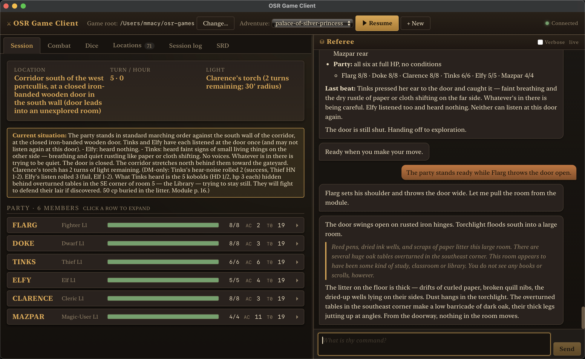

# OSR Game Client

OSR Game Client is a Copilot CLI extension that spawns a native webview for playing OSR adventures with referee plugins from this repository. It keeps the table state, party roster, locations, dice, rules lookup, and referee chat in one desktop window while the agent runs the game.



## What it does

- Opens a desktop client with `/osr-game-client`.
- Connects to a game directory containing `adventures/` and `characters/`.
- Lists existing adventures and can hand off new adventure setup to the active referee plugin.
- Shows the current session state: location, turn/hour, light, current situation, and party HP.
- Provides tabs for combat, dice rolling, keyed locations, session notes/logs, and rules lookup.
- Mirrors the referee conversation in a chat panel, including live thinking/tool status when verbose mode is enabled.

## Requirements

- Copilot CLI with extension support.
- An OSR referee plugin from this repository.
- `uv` on `PATH` when the active plugin uses Python utility scripts.
- A game directory where adventure state can be saved, for example `~/osr-games`.

## Run from this repository

Start Copilot CLI from the repository root so it can load the project extension, then run:

```text
/osr-game-client
```

On first launch, the extension installs any missing Node dependencies and builds the bundled client assets if needed. The setup checklist then asks for:

1. **Game directory**: the root that contains `adventures/` and `characters/`.
2. **Referee plugin location**: the plugin folder containing the referee skills, utility scripts, and rules references used by the active OSR plugin. Auto-detection handles the common local checkout and installed-plugin paths.

## Game files

The client reads and writes player-facing state in the selected game directory:

```text
<game-root>/
├── adventures/<name>/
│   ├── PARTY.md
│   ├── SESSION.md
│   ├── LOCATIONS.md
│   └── .osr-game-client/
└── characters/
```

The `.osr-game-client/` sidecar stores client-only state such as combat tracker data, chat transcript, visited location marks, and notes. It does not replace the canonical `PARTY.md`, `SESSION.md`, or `LOCATIONS.md` files managed by the active referee plugin's skills.
