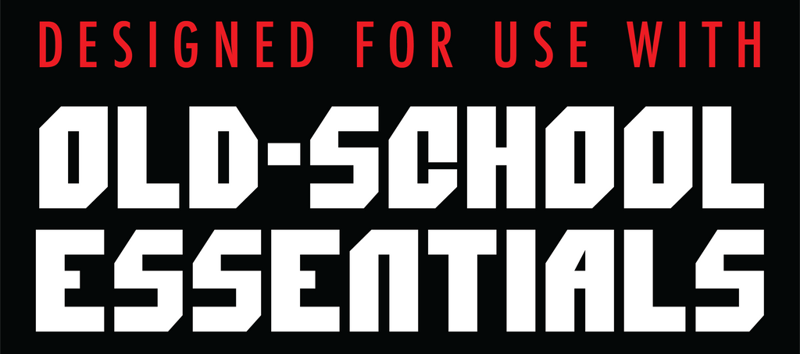

# OSR plugins

A plugin marketplace for AI-powered Old-School Renaissance tabletop RPG tools for [Copilot CLI](https://docs.github.com/copilot/how-tos/copilot-cli), [Claude Code](https://code.claude.com/docs), and other harnesses that can use [agent skills](https://agentskills.io/home).

## Install

```bash
# Add the marketplace and install a plugin
/plugin marketplace add mmacy/osr-plugins
/plugin install bx-referee@osr-plugins
/reload-plugins
```

### Local development

```bash
git clone https://github.com/mmacy/osr-plugins.git
cd osr-plugins
claude --plugin-dir ./plugins/bx-referee
```

## Plugins

### [B/X Referee](plugins/bx-referee/README.md)

<table>
<tr>
<td width="75%">

Your coding agent acts as the referee by running adventures from adventure module files (PDF or Markdown), resolving encounters, adjudicating combat, and tracking party state while you make the characters' decisions.

```console
/plugin install bx-referee@osr-plugins
```

Type `Let's play OSE.` or `/bx-referee:referee` to start playing.

</td>
<td width="25%" align="center">

</td>
</tr>
</table>

## Extensions

### [OSR Game Client](.github/extensions/osr-game-client/README.md)

<table>
<tr>
<td width="75%">

A Copilot CLI extension that spawns a native webview for OSR referee plugins in this repository. It brings the table state, party roster, locations, dice, rules lookup, and referee chat into one desktop window.

```console
/osr-game-client
```

</td>
<td width="25%" align="center">

</td>
</tr>
</table>
